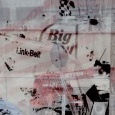
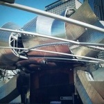
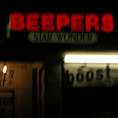
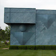
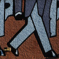
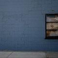

(gallery powered by <a title="GitHub - biati-digital/glightbox: Pure Javascript lightbox with mobile support. It can handle images, videos with autoplay, inline content and iframes" href="https://github.com/biati-digital/glightbox">biati-digital/glightbox</a>)

<script type="text/javascript">
  const lightbox = GLightbox({
    touchNavigation: true,
    loop: true
});
